# 👋 ¡Hola! Soy Luis Ramos

<div align="center">
  
### 🎯 Automatización de Procesos | Análisis de Datos | Estudiante de Ingeniería de Sistemas

*Creando soluciones reales con código - De la teoría a la producción*

[](https://linkedin.com/in/LuisRamosT)
[](mailto:lramostalla54@gmail.com)
[](https://github.com/Ander-R903)


</div>

---

## 🧠 ¿Qué hago?

```python
class LuisRamos:
    def __init__(self):
        self.especialidad = "Automatización & Análisis de Datos"
        self.ubicacion = "Ica, Perú 🇵🇪"
        self.enfoque_actual = ["Web Scraping", "Automatización de Procesos", "Visualización de Datos"]
        self.aprendiendo = ["Machine Learning", "PySpark", "Cloud Computing"]
        
    def say_hi(self):
        print("¡Me encanta resolver problemas con código y datos!")
        
    def daily_routine(self):
        return [
            "☕ Café + código Python",
            "📊 Analizar datos y encontrar insights",
            "🤖 Automatizar lo que nadie quiere hacer manualmente",
            "📈 Crear dashboards que hablen por sí mismos"
        ]
```

---

## 🚀 Proyectos que Brillan

### 🛒 **Retail Price Intelligence Dashboard**
> *¿Por qué pagar más? Compara precios en tiempo real*

 

**El problema:** Consumidores sin información de precios comparados entre supermercados peruanos.

**La solución:**
- 🕷️ **Web Scraping automático** de Tottus y Plaza Vea con Playwright
- 🔄 **ETL pipeline** completo: extracción → limpieza → carga a SQL Server
- 📊 **Dashboard interactivo** en Power BI con análisis de variaciones de hasta 30%
- 💰 Detecta promociones y tendencias de precios

**Tech Stack:** `Python` `Playwright` `Pandas` `Polars` `SQL Server` `SSIS` `Power BI` `DAX`

**Impacto real:** Información estratégica para decisiones de compra informadas

---

### ⚡ **PDF Intelligence Automation**
> *De 4 horas de trabajo manual a 1 minuto automatizado*

 

**El problema:** Análisis manual tedioso de cientos de actas técnicas en PDF.

**La solución:**
- 📄 **Interfaz web** en Streamlit para carga de archivos ZIP
- 🤖 **Extracción inteligente** con pdfplumber + validación automática
- 📊 **Consolidación** en Excel con formato estandarizado
- 🔗 **Integración** con dashboards para reportes en tiempo real

**Tech Stack:** `Python` `pdfplumber` `Streamlit` `Pandas` `openpyxl`

**Impacto real:** 20 horas/semana ahorradas, 0 errores humanos

---

## 🛠️ Stack Tecnológico

<div align="center">

### 💻 Lenguajes


### 📊 Datos y Análisis


### 🤖 Automatización y Nube


### 🧰 Herramientas


</div>

---

## 🎯 2025: Objetivos en Progreso

```mermaid
gantt
    title Mi Roadmap de Aprendizaje
    dateFormat YYYY-MM
    section Machine Learning
    Scikit-learn Avanzado    :active, 2025-01, 3M
    PyTorch Fundamentals      :2025-03, 3M
    section Cloud & Big Data
    Azure Certification       :active, 2025-01, 4M
    PySpark en Producción     :2025-02, 3M
    section Automation
    n8n Workflows Avanzados   :2025-01, 2M
```



---

## 🌱 Actualmente Explorando

- 🧠 **Machine Learning** con Scikit-learn y PyTorch
- ☁️ **Cloud Computing** en Azure y Databricks
- 🔧 **Process Mining** y optimización de flujos
- 📊 **Advanced DAX** para análisis complejos en Power BI

---

<div align="center">


*"Los datos cuentan historias, yo las hago visibles"* ✨

</div>
